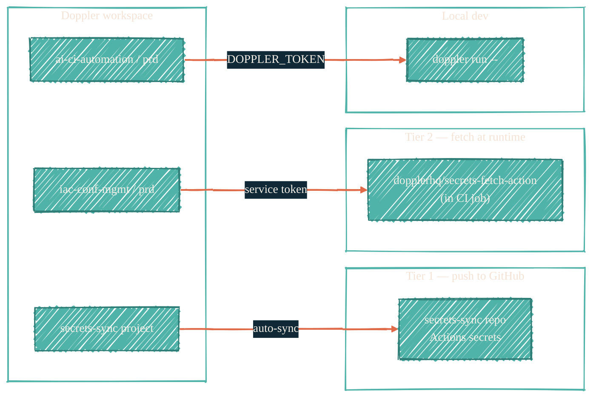

> Doppler holds the values. Everything else is delivery.

## What goes in Doppler

- AI provider keys: `OPENROUTER_API_KEY`, `CLAUDE_CODE_OAUTH_TOKEN`, `COPILOT_GITHUB_TOKEN`, `HF_TOKEN`.
- GitHub App credentials: `GH_APP_CLAUDE_BOT_*`, the SSH signing key for Actions-signed commits.
- Slack webhooks (broadcast and per-channel).
- Infrastructure runtime config: database passwords, RunsOn license, Qdrant credentials.

## What does not go in Doppler

- SSH keys for git auth (lives in Bitwarden + ssh-agent).
- Recovery codes, account passwords, age-key escrow (Bitwarden).
- Anything an AI tool must never read (Bitwarden vault).
- macOS-only GitHub PATs (Keychain — see [macos-keychain](/security/tools/macos-keychain)).

## Project / config layout



Three projects, three delivery modes:

- `secrets-sync` project — Tier 1. Auto-sync pushes values to the `secrets-sync` repo's Actions secrets, where [`secrets-sync`](/security/secrets-sync) fans them out.
- `iac-conf-mgmt/prd` — Tier 2 infra. Read at workflow runtime via `dopplerhq/secrets-fetch-action`. Never lives in any GitHub secrets store.
- `ai-ci-automation/prd` — Local dev + AI tools. Reached via the [`doppler-mcp`](/security/local-ai-isolation) wrapper that scopes secrets to a single subprocess.

## Runtime fetch via GitHub Actions

For Tier 2 secrets that must never sit in GitHub Actions stores:

```yaml
- uses: dopplerhq/secrets-fetch-action@v1
  with:
    doppler-token: ${{ secrets.GH_ACTION_DOPPLER_IAC_CONF_MGMT }}
    inject-env-vars: true
```

The service token `GH_ACTION_DOPPLER_IAC_CONF_MGMT` is itself a Tier 1 secret distributed by `secrets-sync` to the two `_infra_repos`: `ansible-proxmox-apps` and `terraform-runs-on`.

## Local-dev chain

The canonical chain pairs AWS Vault with Doppler so an MFA-protected AWS session wraps the Doppler injection:

```bash
aws-vault exec tf-proxmox -- doppler run -- terragrunt plan
```

Secrets injection happens at `terragrunt`'s subprocess launch — no values touch your shell history or environment.

For Terraform variables specifically, Doppler's name-transformer flag prefixes everything as `TF_VAR_*`:

```bash
doppler run --name-transformer tf-var -- terragrunt plan
```

## Anti-patterns and best practices

- Do not export `DOPPLER_TOKEN` in `~/.zshrc`. Use the `doppler-mcp` wrapper or `doppler login` interactive auth. Tokens persisted in the shell env are reachable by every later command.
- Do not store the same value in both Doppler and the Keychain. Pick one source of truth per secret. The Keychain is for tokens that only the macOS host uses (GitHub PATs); Doppler is for tokens that CI also needs.
- Rotate the service tokens at 90 days. The rotation runbook lives in [secrets-sync](/security/secrets-sync#rotation-cadence-best-practice).
- Audit log: enable Doppler's per-project audit log; review on every PAT/key rotation.

## See also

- [secrets-sync](/security/secrets-sync) — Tier 1 distribution.
- [aws-vault](/security/tools/aws-vault) — the wrapping layer for the local-dev chain.
- [BWS](/security/tools/bws) — alternative for AI-specific OAuth tokens where Doppler is not yet wired up.
- [`docs.dryvist.com`](https://docs.dryvist.com) — dryvist-internal project / config names.
