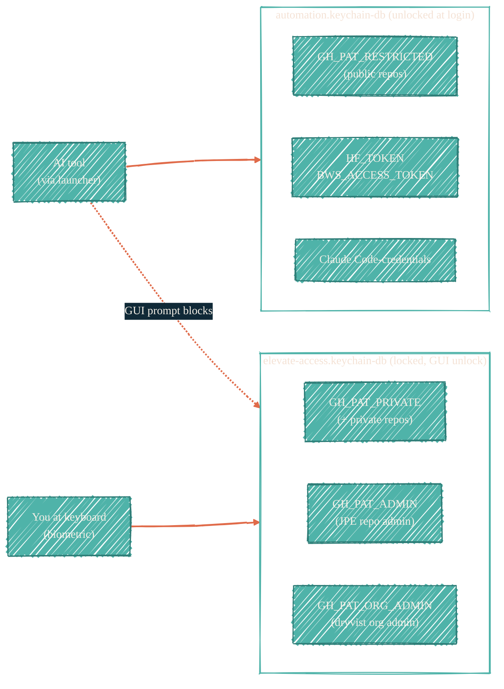

> Two databases, three GitHub-token tiers. Unlock posture decides who can read what.

## Two databases, one rule



The split is the entire access-control model: anything an AI can read non-interactively must live in `automation`. Anything that must require a human at the keyboard goes in `elevate-access`.

## GitHub PAT tiers

| Tier | Service name | Database | Scope | Who uses it |
| --- | --- | --- | --- | --- |
| `RESTRICTED` | `GH_PAT_RESTRICTED` | `automation` | Public repos | `gh-restricted`, `gh-claude-restricted`, CI smoke jobs |
| `PRIVATE` | `GH_PAT_PRIVATE` | `elevate-access` | + private repos | `gh-private`, `gh-claude-private` (human only) |
| `ADMIN` | `GH_PAT_ADMIN` | `elevate-access` | JPE repo admin | `gh-admin`, `gh-claude-admin` (human only) |
| `ORG_ADMIN` | `GH_PAT_ORG_ADMIN` | `elevate-access` | dryvist org admin | `.github-tofu` apply (human only) |

The switching helpers (`gh-restricted` / `gh-private` / `gh-admin`) export `GITHUB_TOKEN` into the current shell. The AI-launcher variants (`gh-claude-*`) wrap the export in a subshell so the token never leaks to the parent — see [Local AI isolation](/security/local-ai-isolation).

## Reading a keychain entry the right way

The last positional argument is the keychain path. Omit it and `security` searches the login keychain only — which does not contain these entries. Always pass the path explicitly so the lookup hits the right database:

```bash
# Fetch once into a variable; never inline the read into every command.
GITHUB_TOKEN=$(security find-generic-password \
  -a ai-cli-coder \
  -s GH_PAT_ORG_ADMIN \
  -w \
  ~/Library/Keychains/elevate-access.keychain-db)

# Use the variable.
GITHUB_TOKEN=$GITHUB_TOKEN tofu plan
GITHUB_TOKEN=$GITHUB_TOKEN tofu apply
```

For `automation` keychain entries, swap the path to `~/Library/Keychains/automation.keychain-db`. Each `security find-generic-password` call against `elevate-access` triggers an unlock prompt; inlining the read on every command would prompt every time. Fetch once, inject the variable across the session — and unset it when done.

## Adding a new keychain entry

```bash
security add-generic-password \
  -U \
  -a ai-cli-coder \
  -s GH_PAT_NEW_TOKEN \
  -w '<token-value>' \
  ~/Library/Keychains/automation.keychain-db
```

Replace `automation.keychain-db` with `elevate-access.keychain-db` for human-only entries. The `-U` flag updates if the entry already exists.

## Best practices

- One account name for AI-readable entries: `ai-cli-coder`. The `-a` flag is the discriminator the launchers use.
- Never put a value in `automation` that should require human approval. The unlock posture is the whole point.
- Cap the auto-lock timeout on `elevate-access` (~5 minutes idle) so an abandoned session re-locks.
- Touch ID for sudo (`security.pam.enableSudoTouchIdAuth = true` in nix-darwin) ensures even the human path requires biometric confirmation.

## See also

- [Local AI isolation](/security/local-ai-isolation) — the subshell scoping that pairs with the keychain split.
- [BWS](/security/tools/bws) — uses `automation` for its access token to remain AI-reachable.
- [`nix-darwin/hosts/macbook-m4/gh-token-switching.zsh`](https://github.com/JacobPEvans/nix-darwin/blob/main/hosts/macbook-m4/gh-token-switching.zsh) — the literal switching helpers.
