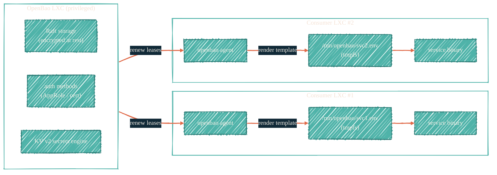

<Note>
Status: **planned**, not in production. Architecture sketch only. The Ansible roles
exist as scaffolding; no LXC is running OpenBao today.
</Note>

> The day the homelab needs more than per-host SOPS, this is what catches it.

## Why a self-hosted layer

Doppler handles AI keys and broadly-shared CI secrets. SOPS handles encrypted-in-repo config. The Bitwarden vault holds the human-only material. Between these three, the homelab is covered for the *static* secrets it needs — but service-to-service auth inside the cluster (one LXC reading from another's API) is currently handled by per-host env files and shared-secret config baked at apply time.

That works at small scale. It scales poorly. OpenBao — the MPL-licensed fork of HashiCorp Vault 1.14.x, the last release before HashiCorp's BSL transition in 1.15 — is the planned answer: a single source of truth for cluster-local secrets, with leases, audit, and per-service auth methods.

## Planned architecture

Three deliberate choices in this sketch:

1. **Privileged LXC for OpenBao itself.** OpenBao's mlock / memlock requirements need a privileged container; the security surface gain is acceptable in exchange for predictable behavior.
2. **One agent per consumer LXC.** Each consumer holds its own AppRole credentials and renews leases locally. The OpenBao server never sends secrets to a host that hasn't authenticated.
3. **tmpfs rendering.** Secrets are written to `/run/openbao/*.env`, which is a memory-backed filesystem destroyed on reboot. No persistence to disk.

## Auth model (planned)

- **AppRole per service.** Each consumer LXC has a role ID (durable) and a secret ID (rotating). The Ansible role distributes role IDs in cleartext but obtains secret IDs from OpenBao at consumer-LXC provision time.
- **Periodic tokens** for long-running services where re-authentication would be operationally heavy.
- **TLS cert-based auth** considered for the most sensitive services as a defense-in-depth posture later.

## Boundary with the existing tools

- Doppler: continues as the source of truth for **CI secrets** and **AI provider keys**. OpenBao is for **cluster-local** secrets only.
- SOPS: continues as the source of truth for **at-rest in-repo config**. OpenBao is for **runtime-resolved** secrets where lease/renew matters.
- Bitwarden: continues as **human-only cold storage**. OpenBao seed material (initial root token, recovery shares) is escrowed in Bitwarden.

The four layers compose; OpenBao does not replace any existing layer.

## Roadmap

1. **Phase 0 (current).** Ansible role skeleton in [`dryvist/ansible-server-apps`](https://github.com/dryvist/ansible-server-apps). No production deploy.
2. **Phase 1.** Stand up a single OpenBao LXC; recovery-shamir initialization; root-token escrow in Bitwarden; baseline KV engine for non-production secrets only.
3. **Phase 2.** Migrate first consumer (likely Cribl Edge auth tokens). Validate lease renewal, audit log to Splunk, behavior under reboot.
4. **Phase 3.** Migrate remaining services. Begin rotating production secrets out of `/etc/<svc>/env` files into agent-rendered tmpfs files.
5. **Phase 4.** HA: second OpenBao node with Raft replication.

Each phase has its own rollback. Phase 1 specifically does not block: if Phase 2 reveals a problem we can leave Phase 1 idle and continue using the existing per-host pattern.

## Sealed posture, audit trail, and the human-in-the-loop rule

- **Sealed at rest.** OpenBao restarts in a sealed state requiring N-of-M unseal shares. Shares live in Bitwarden — recovering them is a [Golden law #3](/security/golden-laws#3-human-approval-gates-every-potentially-destructive-action) human-in-the-loop event.
- **Audit log to Splunk.** Every read, write, and policy change appears in Splunk via the standard OpenBao audit-device → file → Cribl Edge path.
- **Recovery is rehearsed.** Annual unseal-from-shares drill on a non-production OpenBao instance ([Golden law #15](/security/golden-laws#15-backup-the-vault-itself-and-test-recovery)).

## See also

- [Golden laws](/security/golden-laws) — every planned posture above maps to a law.
- [`dryvist/ansible-server-apps`](https://github.com/dryvist/ansible-server-apps) — current scaffolding.
- [`docs.dryvist.com`](https://docs.dryvist.com) — when this lands, dryvist-internal specifics (cluster topology, lease policies) live there.
