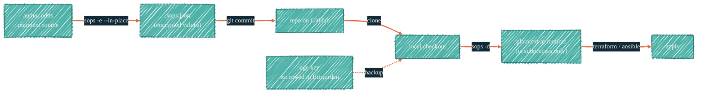

> If it can be encrypted and committed, SOPS holds it. If it must rotate, Doppler does.

## What SOPS is for

SOPS encrypts the *values* in a structured config file (YAML, JSON, TOML, dotenv, INI) while leaving the keys readable. The encrypted output is a regular file with structured contents — e.g. `terraform.sops.json`, `secrets.enc.yaml` — that lives in git and is decrypted at runtime by the age private key. The repo-root `.sops.yaml` is a separate, unencrypted *configuration* file that tells SOPS which paths to encrypt and with which keys (see [.sops.yaml configuration](#sops-yaml-configuration) below).

It is **not** a vault. It is checked-in, encrypted-at-rest configuration — perfect for: Terraform variables that name internal networks, initial-bootstrap passwords for Proxmox/iDRAC, ansible variables that vary per host but aren't truly secret-secret.

## What does not belong in SOPS

- Live API keys that rotate frequently — `git log` keeps the encrypted history forever, and "encrypted today" is only as strong as the age key. Use Doppler.
- SSH keys, recovery codes — these are human-only material; Bitwarden.
- Anything you cannot afford to have in a public-fork forever — encryption is not deletion.

## The encrypt / commit / decrypt cycle



The plaintext exists only in memory during the apply step. The committed `.sops.json` keeps metadata (key fingerprints, file hash) readable so reviewers can see what changed at the structural level without seeing values.

## `.sops.yaml` configuration

Each repo that uses SOPS has a `.sops.yaml` declaring which paths get encrypted with which keys:

```yaml
creation_rules:
  - path_regex: \.sops\.json$
    age: >-
      age1aaaa... # public age recipient
```

Only the public half of the age key appears here. The private half lives at `~/.config/sops/age/keys.txt` (local convenience) and is escrowed in Bitwarden (canonical backup).

## Editing an existing SOPS file

```bash
sops .sops.json
```

`sops` opens the editor; you edit plaintext; on save it re-encrypts. Never `git add` an unencrypted copy. Pre-commit hooks (provided in `terraform-proxmox` and friends) verify every staged `.sops.json` is actually encrypted.

## Rotating the age key

1. Generate a new key: `age-keygen -o ~/.config/sops/age/keys.txt.new`
2. Update `.sops.yaml` in each affected repo to add the new public recipient (keep the old one until cutover).
3. Run `sops updatekeys .sops.json` across every encrypted file.
4. Remove the old recipient from `.sops.yaml`; run `sops updatekeys` again.
5. Escrow the new key in Bitwarden; revoke the old.

The cycle is documented in [`agentsmd/rules/config-secrets.md`](https://github.com/JacobPEvans/ai-assistant-instructions) — keep it in muscle memory for the team.

## Best practices

- Escrow the age private key in Bitwarden the moment it is generated. The local file is convenience; the escrow is canonical.
- Use one age key per "trust domain" — homelab gets one key, AWS infra gets another. Compromise of one does not leak the other.
- Pre-commit hook in every repo that uses SOPS to verify staged `.sops.json` files have non-plaintext values. This is the cheapest control.
- Never store the same value in both SOPS and Doppler. If it rotates, it belongs in Doppler. If it doesn't, SOPS.

## Anti-pattern we don't ship

A plaintext "starter" config like `terraform.tfvars.example` that gets renamed to `terraform.tfvars` and accidentally committed. The pattern we use: ship `terraform.sops.json.example` (already encryption-shaped); the rename-and-commit only ever produces an encrypted file.

## See also

- [Doppler](/security/tools/doppler) — for values that rotate.
- [Bitwarden](/security/tools/bitwarden) — where age private keys are escrowed.
- [`terraform-proxmox`](https://github.com/JacobPEvans/terraform-proxmox) — canonical example of `.sops.yaml` + pre-commit + editing workflow.
