> The docs build themselves. Almost.

`mintlify-docs-update` is a Claude Code skill that scans `JacobPEvans` (and `Drivist`), diffs the result against this site, and proposes the missing pages. It lives in `.claude/skills/mintlify-docs-update/` and is invoked manually via `/mintlify-docs-update` or on a cadence by the global `auto-maintain` orchestrator.

## How the skill works

```mermaid
%%{init: {'theme':'base','look':'handDrawn','themeVariables':{'primaryColor':'#4FB3A9','primaryTextColor':'#F4EFE6','primaryBorderColor':'#2F7E78','lineColor':'#E06B4A','secondaryColor':'#102937','tertiaryColor':'#0B1D2A','clusterBkg':'transparent','clusterBorder':'#4FB3A9','fontFamily':'Geist','fontSize':'15px'}}}%%
flowchart LR
  Skill(["/mintlify-docs-update"]) -->|gh repo list| Repos[("GitHub<br/>JacobPEvans + Drivist")]
  Repos --> Filter(["filter: non-archived,<br/>non-fork, public"])
  Filter --> Diff(["diff against<br/>existing pages"])
  Diff --> Tmpl(["scaffold from<br/>template-repo-page.mdx"])
  Tmpl --> Pages(["new .mdx files"])
  Tmpl --> Nav(["docs.json sidebar<br/>update"])
  Pages --> Guard(["page-length guard<br/>+ mint broken-links"])

  style Skill fill:transparent,stroke:#E06B4A,stroke-width:4px,color:#F4EFE6
  style Repos fill:transparent,stroke:#4FB3A9,stroke-width:3px,color:#F4EFE6
  style Filter fill:transparent,stroke:#4FB3A9,stroke-width:2px,color:#F4EFE6
  style Diff fill:transparent,stroke:#4FB3A9,stroke-width:2px,color:#F4EFE6
  style Tmpl fill:transparent,stroke:#4FB3A9,stroke-width:2px,color:#F4EFE6
  style Pages fill:transparent,stroke:#4FB3A9,stroke-width:2px,color:#F4EFE6
  style Nav fill:transparent,stroke:#4FB3A9,stroke-width:2px,color:#F4EFE6
  style Guard fill:transparent,stroke:#4FB3A9,stroke-width:2px,color:#F4EFE6

  linkStyle default stroke:#E06B4A,stroke-width:3px
```

The skill is **conservative**: it only scaffolds *missing* pages. Existing pages are never overwritten. The author edits in detail, then commits.

## Page tiers

Every page declares a tier in frontmatter. The skill enforces caps:

<CardGroup cols={2}>
  <Card title="Tier 1 — overviews & landings" icon="display">
    First-encounter pages. Single screen. ≤450 words. No scrolling on a 1080p browser.
  </Card>
  <Card title="Tier 2 — repo & technical" icon="file-code">
    Repo deep dives and how-to pages. 1–2 screens. ≤900 words. Over budget → split into sub-pages.
  </Card>
</CardGroup>

## Planned improvements

These five skills are filed as GitHub issues and tracked in the `enhancement` + `skill` labels.

<CardGroup cols={2}>
  <Card title="mintlify-page-author" icon="pen-nib" href="https://github.com/JacobPEvans/docs/issues/2">
    Author a single page from a repo URL or topic. Enforces Reef Green theme, house voice, the tier cap, and standard components (Card grid + Steps + Frame + Mermaid).
  </Card>
  <Card title="mintlify-visual-audit" icon="chart-bar" href="https://github.com/JacobPEvans/docs/issues/3">
    Grade every page on tier-aware word count, component variety, theme compliance, dead-link risk. Output: red/amber/green report with a prioritized fix list.
  </Card>
  <Card title="mintlify-mermaid-theme" icon="diagram-project" href="https://github.com/JacobPEvans/docs/issues/4">
    Generate Reef Green-themed Mermaid with pinned theme variables and house shape conventions. Wraps `obsidian-visual-skills:mermaid-visualizer` with project-specific defaults.
  </Card>
  <Card title="mintlify-nav-sync" icon="bars-staggered" href="https://github.com/JacobPEvans/docs/issues/5">
    Keep `docs.json` sidebar in sync with the filesystem. Detect orphan pages, missing files, and propose ordered group structures.
  </Card>
  <Card title="mintlify-build-guard" icon="shield-halved" href="https://github.com/JacobPEvans/docs/issues/6">
    Pre-commit + CI validator. `mint dev` + `mint broken-links` + frontmatter check + image refs + tiered word cap + Mermaid parse. Pass/fail report with line numbers.
  </Card>
  <Card title="All open issues" icon="github" href="https://github.com/JacobPEvans/docs/issues?q=is%3Aissue+is%3Aopen+label%3Askill">
    The live tracker for skill improvements.
  </Card>
</CardGroup>

## Where to go next

<CardGroup cols={2}>
  <Card title="Tools overview" icon="screwdriver-wrench" href="/tools/overview">
    The rest of the developer-utility surface.
  </Card>
  <Card title="claude-code-plugins" icon="plug" href="/ai-development/claude-code-plugins">
    The broader plugin ecosystem this skill draws from.
  </Card>
</CardGroup>
