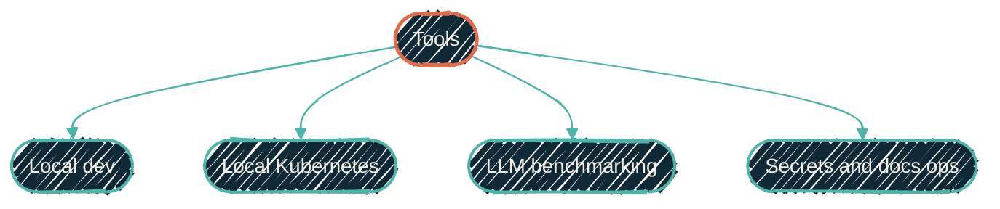

{/* projected from the authoring site; do not edit here */}
> The small stuff that holds everything else together.

Not every repo is a flagship. These are the utilities, templates, and
meta-tools that keep the rest of the portfolio reproducible, observable, and
easy to fork. Each one solves a single cross-cutting problem: a starter
template, a benchmark harness, a secrets sync job. That keeps the flagship
repos from having to solve it themselves.

## By purpose

{/*Shape: one hub fanning to 4 purpose categories. Nodes: 5. Aspect: ~2:1 TB. Pass.*/}

<CardGroup cols={2}>
<Card
  title="Local development"
  icon="laptop-code"
  href="https://github.com/JacobPEvans/python-template">
  `python-template` — pytest + pre-commit + coverage starter. `gh repo create --template` and go.
</Card>
<Card
  title="Local Kubernetes"
  icon="dharmachakra"
  href="https://github.com/JacobPEvans/orbstack-kubernetes">
  `orbstack-kubernetes` — K8s on OrbStack with OTEL + Cribl pre-wired. Dev-loop K8s without a cloud bill.
</Card>
<Card
  title="Local LLM benchmarking"
  icon="microchip"
  href="/tools/mlx-benchmarks">
  `mlx-benchmarks` — measure model quality and throughput on Apple Silicon. Envelope schema, publisher, public HF dataset, viewer.
</Card>
<Card
  title="GitHub Actions secrets"
  icon="key"
  href="https://github.com/JacobPEvans/secrets-sync">
  `secrets-sync` — pull from a backend, push to repos, audit drift.
</Card>
<Card
  title="Network utilities"
  icon="network-wired"
  href="https://github.com/JacobPEvans/unifi-backup-decrypt">
  `unifi-backup-decrypt` (archived) — decrypt UniFi controller backups for inspection and migration.
</Card>
<Card
  title="Docs automation"
  icon="wand-magic-sparkles"
  href="/tools/automation">
  `mintlify-docs-update` — keep this site in sync with all the repos it covers.
</Card>
</CardGroup>

## Where to go next

<CardGroup cols={2}>
<Card
  title="Docs automation"
  icon="wand-magic-sparkles"
  href="/tools/automation">
  The skill that builds new repo pages.
</Card>
<Card
  title="Nix Ecosystem"
  icon="snowflake"
  href="/nix/overview">
  Where the reusable dev shells these tools depend on live.
</Card>
</CardGroup>
